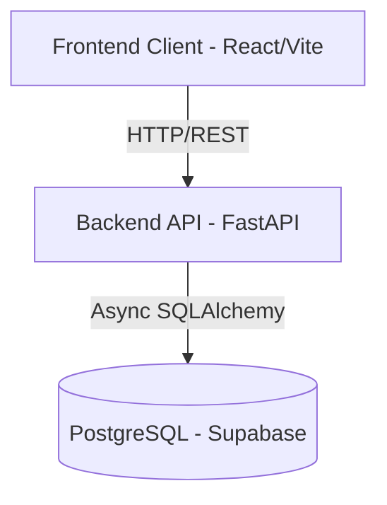

# System Architecture

TransitOps follows a modern, decoupled client-server architecture.

## High-Level Architecture Diagram

## 1. The Client Layer (Frontend)
The frontend is a Single Page Application (SPA) built with [[Tech Stack|React and TypeScript]]. It focuses heavily on UX, utilizing a custom [[Styling & UI System|Glassmorphism UI system]] built with Tailwind CSS. State is managed via React Query for server state caching and React context for UI state.

See: [[Frontend Architecture]]

## 2. The API Layer (Backend)
The backend is a RESTful API built with [[Tech Stack|FastAPI (Python)]]. It exposes endpoints for the frontend to consume. The backend is strictly layered into:
- **[[Controllers & Routes|Controllers (Routers)]]**: Handle HTTP requests/responses and route definitions.
- **[[Services Layer|Services]]**: Contain all business logic and orchestration.
- **[[Repositories Layer|Repositories]]**: Handle direct database access using SQLAlchemy.

See: [[Backend Architecture]]

## 3. The Data Layer (Database)
We use a hosted PostgreSQL instance via Supabase. We interact with it exclusively via the SQLAlchemy ORM using async drivers (`asyncpg` / `aiosqlite` for local dev). 

See: [[Database Overview]]

## Architectural Trade-offs
### Why Decoupled (SPA + REST) over Full-Stack Frameworks (Next.js/Remix)?
- **Separation of Concerns**: The Python backend can be easily extended to run heavy machine learning workloads (e.g., predictive maintenance, route optimization) in the future. Python excels at this, whereas Node.js is less suited.
- **Client-Heavy UI**: The dashboard relies heavily on complex data visualizations (Recharts) and animations (Framer Motion). An SPA provides a highly interactive, app-like feel without constant server roundtrips.

### Why Layered Backend Architecture?
We strictly separate routes, services, and repositories.
- **Why?** It makes testing significantly easier. You can test a service by mocking its repository without needing to spin up an HTTP server or database. It also prevents "fat controllers" where HTTP logic and business logic are tangled.
