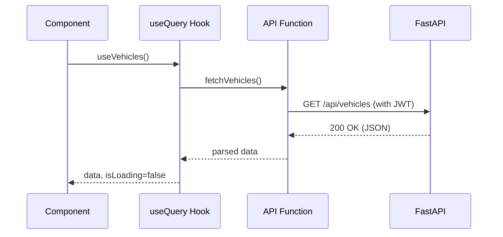

# API Integration

The frontend communicates with the [[Backend Architecture|FastAPI Backend]] using **Axios**.

## The Axios Instance
Located in `src/api/client.ts` (or similar). We create a singleton Axios instance rather than calling `axios.get` directly.

### Why a singleton instance?
1. **Base URL**: We configure the `baseURL` once (e.g., pulling from `import.meta.env.VITE_API_URL`).
2. **Interceptors**: We attach interceptors to automatically inject the Authentication token (JWT) into the `Authorization` header of every request.
3. **Error Handling**: We can globally catch `401 Unauthorized` responses and automatically log the user out or attempt a token refresh.

## API Functions
API calls are organized into domain-specific files (e.g., `src/api/vehicles.ts`, `src/api/trips.ts`).

```typescript
// Example
export const fetchVehicles = async (): Promise<Vehicle[]> => {
  const response = await apiClient.get('/api/vehicles');
  return response.data;
};
```

These functions are completely decoupled from React. They are purely async Javascript functions. They are consumed by the [[State Management|React Query hooks]].

## Data Flow Diagram

