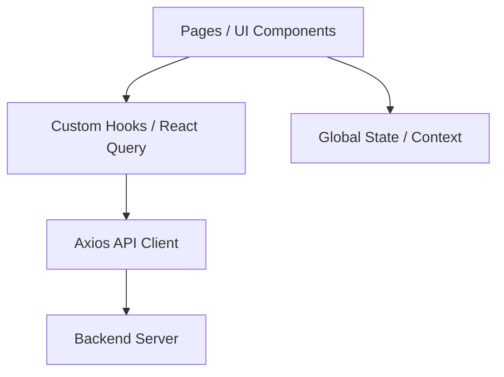

# Frontend Architecture

TransitOps uses a React Single Page Application (SPA) compiled with Vite.

## Architecture Diagram

## Core Principles
1. **Component-Driven UI**: UIs are constructed by combining reusable [[Components]] (atoms/molecules) into full [[Pages & Routing|Pages]].
2. **Server-State Separation**: We heavily separate "Server State" (data from the backend) from "Client State" (modals open, current tab). See [[State Management]].
3. **Strict Typing**: All API responses and prop interfaces are strongly typed with TypeScript to catch errors early.

## The Rendering Flow
1. User requests a route (e.g., `/dashboard`).
2. React Router mounts the corresponding Page component (`DashboardPage.tsx`).
3. The Page calls a custom hook (`useReports()`).
4. React Query checks its cache. If empty or stale, it triggers the [[API Integration|Axios API function]].
5. While fetching, the Page renders a skeleton or loading state.
6. The backend returns data, React Query updates its cache and triggers a re-render.
7. The Page passes the typed data down to presentation components (like `ChartCard`).

## Why Vite over Create React App?
Vite uses native ES modules during development, making the dev server start instantly regardless of app size. HMR (Hot Module Replacement) is consistently fast, massively improving developer productivity.
