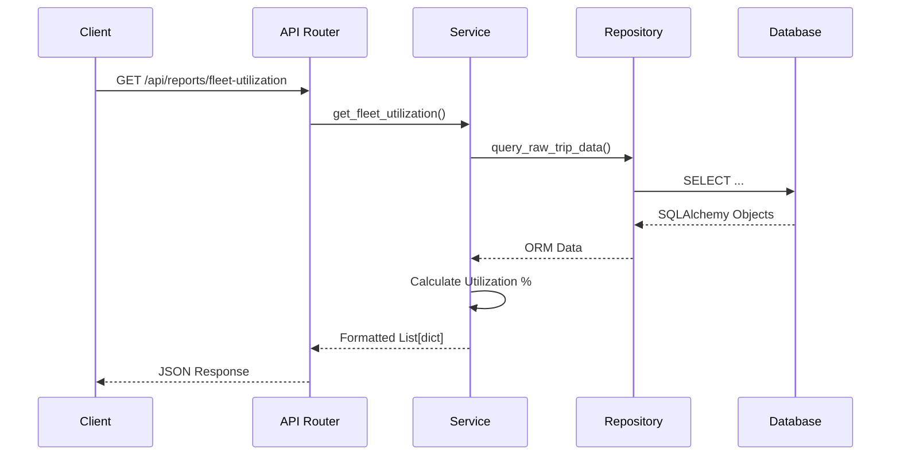

# Backend Architecture

The backend of TransitOps is built with **FastAPI** (Python). It is strictly structured using a Domain-Driven, Layered Architecture.

## The Three Layers
We separate concerns to make the codebase highly testable and maintainable.

1. **[[Controllers & Routes]] (Presentation)**: Extracts data from HTTP requests and returns HTTP responses.
2. **[[Services Layer]] (Business Logic)**: Enforces business rules, calculates KPIs, and orchestrates data from repositories.
3. **[[Repositories Layer]] (Data Access)**: Executes SQLAlchemy queries against the [[Database Overview|Database]].

## Architecture Flow Diagram

## Core Backend Dependencies
The backend heavily utilizes FastAPI's Dependency Injection system (`Depends()`).
- `get_db`: Yields an `AsyncSession` for database queries.
- `get_current_user`: Extracts and validates the JWT, injecting the `User` object into the route handler.

## Why Layered Architecture?
It prevents "Fat Controllers". In a standard tutorial FastAPI app, you often see raw SQL queries mixed with HTTP response logic inside the route handler. By extracting SQL to Repositories and Logic to Services, we can easily unit test the Service without spinning up an HTTP server or a database.
