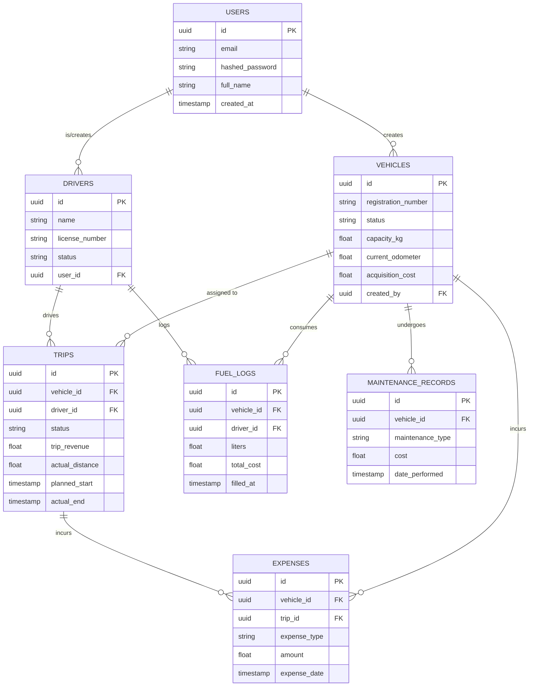

# Entity-Relationship Diagram

This Mermaid diagram illustrates the relationships between the core database tables in TransitOps.

## Key Relationships
- **Vehicles to Trips (1:N)**: A vehicle goes on many trips.
- **Drivers to Trips (1:N)**: A driver operates many trips.
- **Trips to Expenses (1:N)**: A trip can incur specific expenses (like Tolls). If an expense isn't tied to a trip, it might just be tied to the Vehicle.
