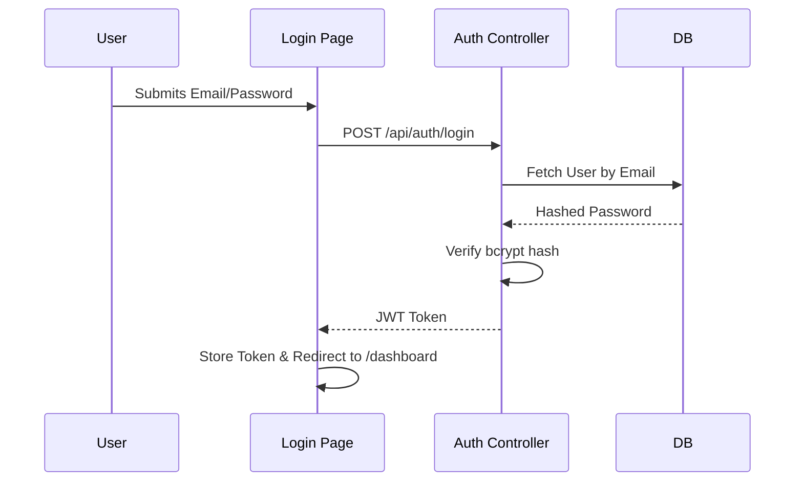

# Feature: Authentication

## Purpose
Secures the platform. Allows only registered users to access the dashboard and API endpoints.

## Architecture & Flow

## Frontend Implementation
- **Page**: `frontend/src/pages/auth/LoginPage.tsx`
- **State**: The JWT token is currently stored in `localStorage` or memory, depending on implementation. The `<ProtectedRoute>` component intercepts routing if the token is missing.

## Backend Implementation
- **Router**: `backend/app/api/endpoints/auth.py`
- **Service**: `backend/app/services/auth_service.py`
- **Security Logic**: `backend/app/core/security.py` (Contains JWT encoding/decoding and password hashing).

## Common Bugs & Gotchas
- **Token Expiry**: If the JWT expires while a user is actively using the app, the next API call will return `401 Unauthorized`. The Axios interceptor must catch this and redirect to login (or attempt a silent refresh).
- **CORS Issues**: Ensure the frontend origin is correctly listed in FastAPI's CORS middleware.

## Future Improvements
- **Refresh Tokens**: Implement a short-lived access token + long-lived HttpOnly secure cookie refresh token pattern to prevent XSS token theft.
- **Role-Based Access Control (RBAC)**: Currently, any authenticated user can view the dashboard. We should restrict actions (like deleting vehicles) to `ADMIN` roles.
