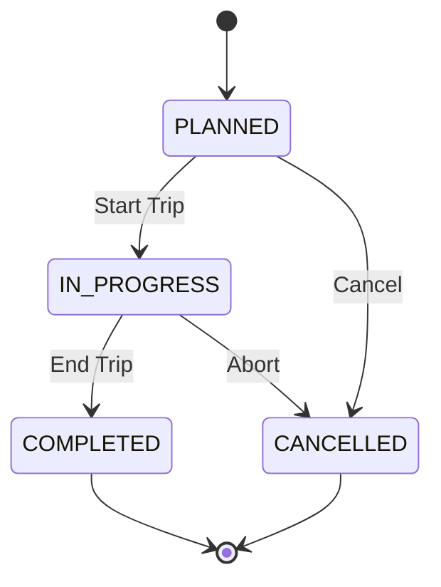

# Feature: Trip Tracking

## Purpose
Manage the lifecycle of a trip from planning to completion, linking a Driver and a Vehicle to a specific revenue-generating event.

## Trip Lifecycle State Machine

## Backend Orchestration (The "Service" Pattern)
Updating a trip status is not a simple database `UPDATE`. It requires orchestrating multiple models.
When a trip transitions to `COMPLETED`:
1. `actual_end` timestamp is recorded.
2. The linked `Vehicle.status` must be reverted to `AVAILABLE`.
3. The linked `Driver.status` must be reverted to `AVAILABLE`.
4. `Vehicle.current_odometer` must be updated by `actual_distance`.

**This is why the [[Services Layer]] is critical.** A `TripService` executes this inside a single database transaction.

## Future Improvements
- **Map Integration**: Integrate Google Maps API to calculate estimated distances during the `PLANNED` phase, and track actual GPS routes during `IN_PROGRESS`.
